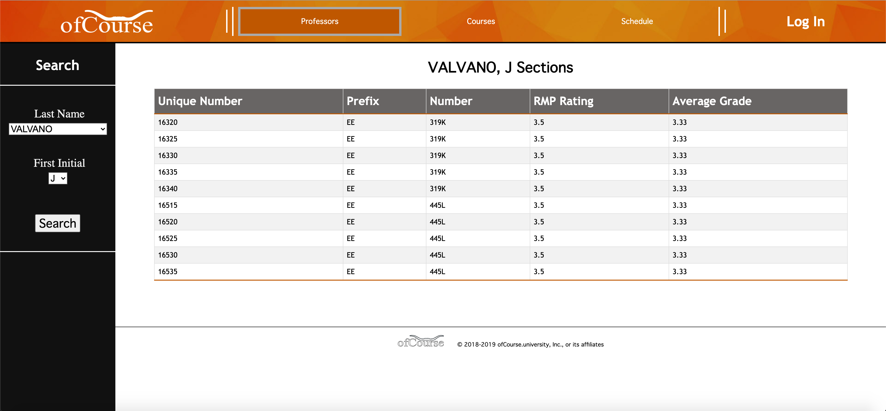
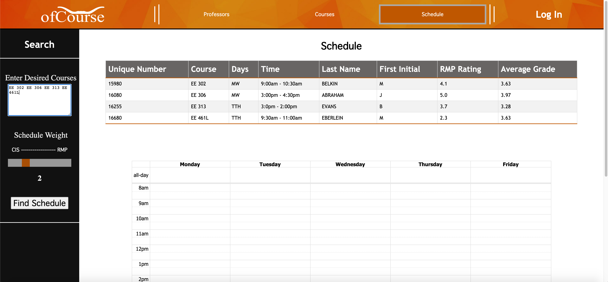
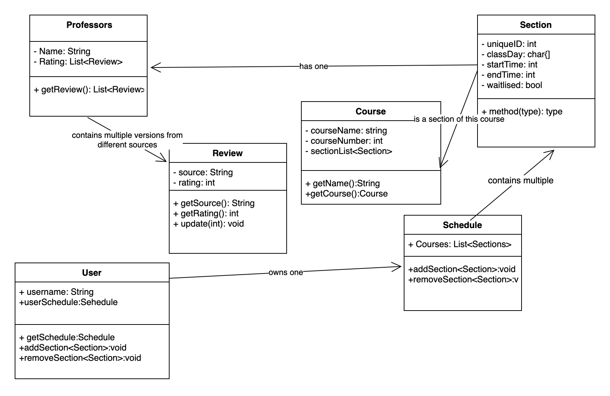
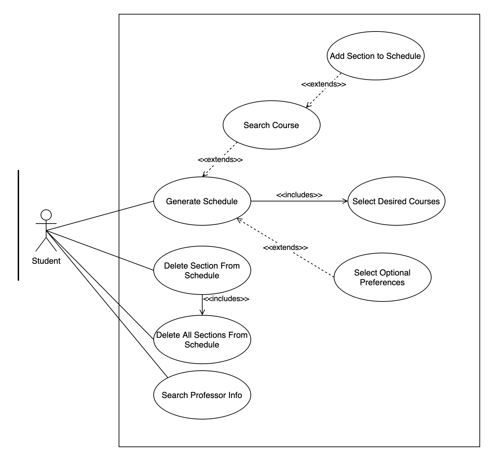
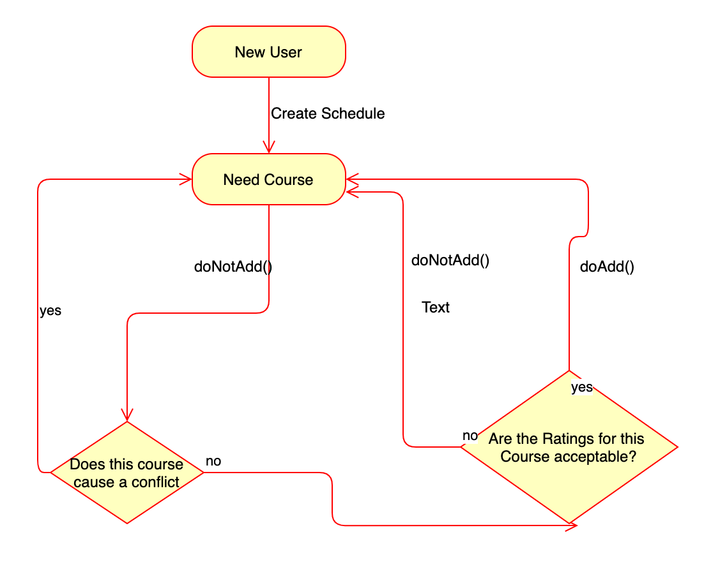

# ofCourse Course Scheduling WebApp

The web solution for students in need of the perfect schedule. Schedule, explore, and decide all in one place in the span of minutes. Classes fill up ten minutes before your registration? ofCourse will automatically ignore the invalid courses and get you the next best thing before that fills up too.

***

## Product Demo

[**Demo Site**](ofcourse-461l.uc.r.appspot.com)

### Screenshots

***

## Getting Started

### Installing

- clone the repository and open in the eclipse IDE
- install the GoogleAppEngine plugin
- build & deploy
- configure Google Cloud Datastore

***

## Internal Design

### Class Diagram

### Use Case Diagram

### Flow Chart 

***

## Built With

* [JavaServerPages (JSP)](https://www.oracle.com/java/technologies/jspt.html) - frontend logic
* [Java](https://www.oracle.com/java/) - backend logic
* [HTML/CSS]() - frontend styling
* [Google App Engine](https://cloud.google.com/appengine) - deployment framework

## Authors

* **Dylan Cauwels** - *Frontend, Backend, & Deployment*
* **Jacob Valencia** - *Algorithm Design*
* **Michael Arthur** - *Data Scraping & Management*
* **Jonathan Wu** -- *Backend*
* **Jack Manning** -- *Frontend*

## Copyright

© UT 2020

## Acknowledgments

* **Dr. Mary Eberlein** - Course Instructor